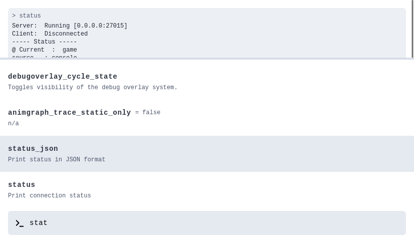

# CS2 RCON Userinterface

A simple userinterface to interact with a cs2 server via rcon.

<picture>
  <source media="(prefers-color-scheme: dark)" srcset="./docs/screen-dark.png">
  
</picture>


## Features

* Console based on `xtermjs`
* Autocomplete commands
* History with arrow keys

## Usage

```yml
version: '3.7'

services:
  rcon:
    image: ghcr.io/janstuemmel/cs2-rcon
    environment:
      HOST: my-server.com
      PORT: 27015
      RCON_PASS: my-s3cret
    ports:
      - "3000:3000"
```